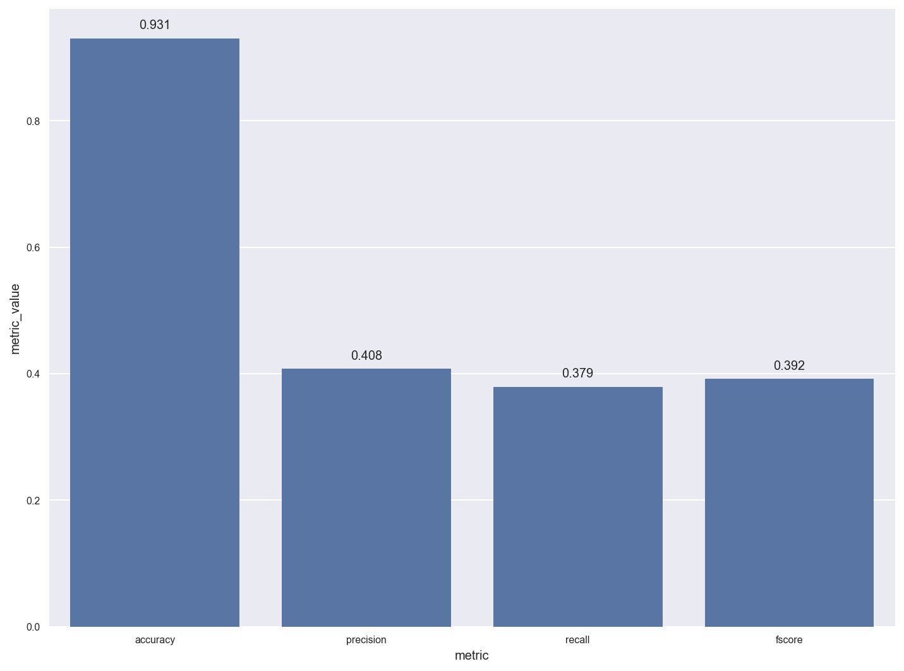
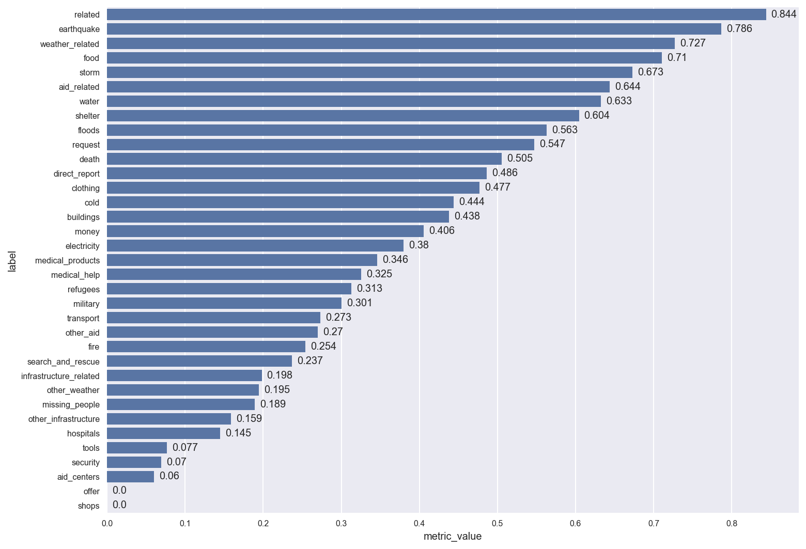
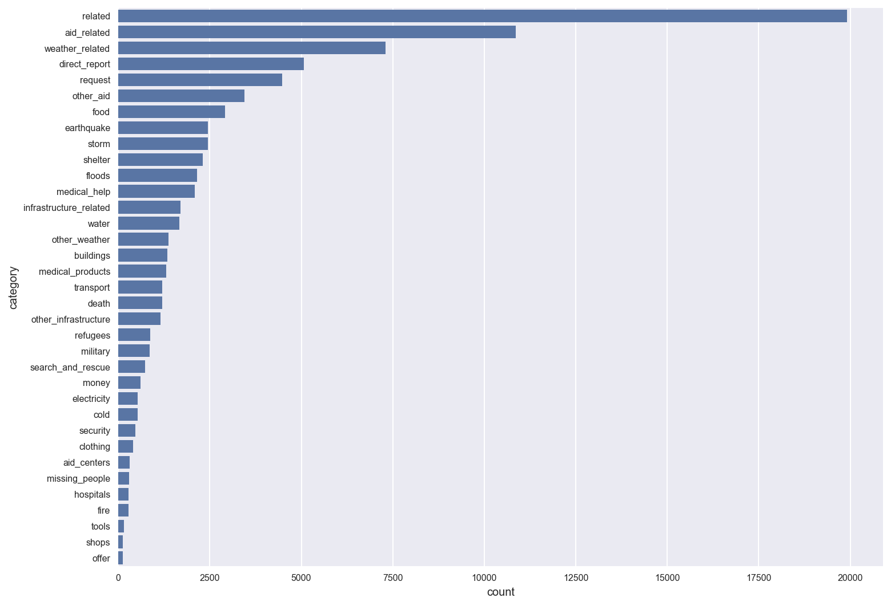
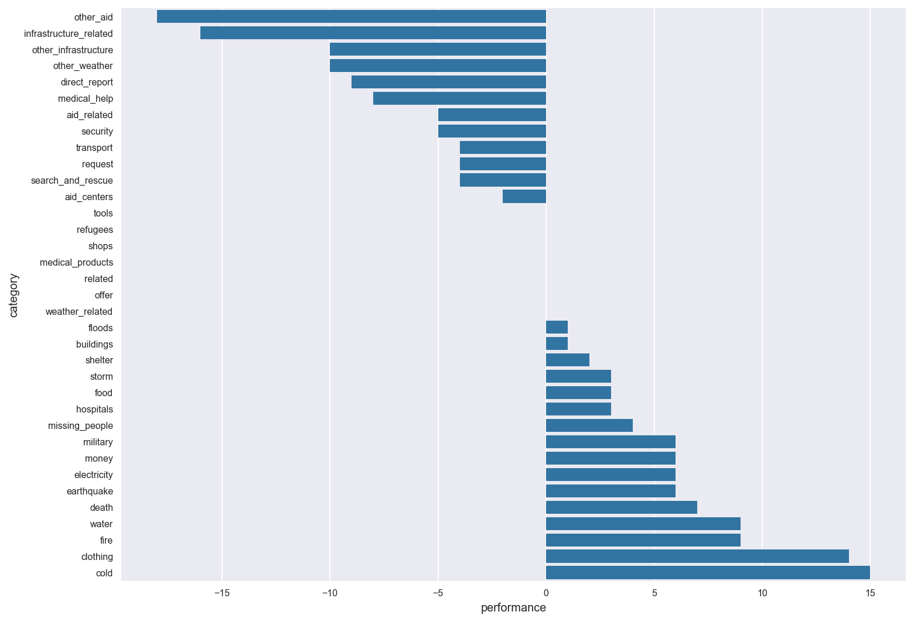
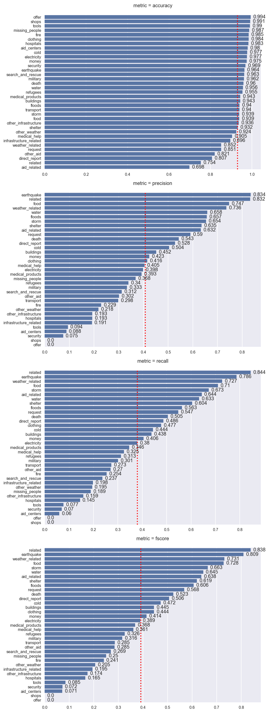

# Disaster Response Pipeline Project

Udacity Data Scientist Nanodegree Project 2

# Installation
Please clone the repository https://github.com/DigiData-Flo/DisasterResponse.git<br>
Please ensure that you are able to load the following packages

```
import re
from sqlalchemy import create_engine
import pandas as pd
import numpy as np
import seaborn as sns
import matplotlib.pyplot as plt
import matplotlib as mpl
import nltk
from nltk.tokenize import word_tokenize
from nltk.stem.wordnet import WordNetLemmatizer
from nltk.corpus import stopwords
from sklearn.pipeline import Pipeline
from sklearn.pipeline import FeatureUnion
from sklearn.feature_extraction.text import CountVectorizer
from sklearn.feature_extraction.text import TfidfTransformer
from sklearn.multioutput import MultiOutputClassifier, ClassifierChain
from sklearn.ensemble import RandomForestClassifier
from sklearn.tree import DecisionTreeClassifier
from sklearn.svm import SVC
from sklearn.model_selection import train_test_split
from sklearn.model_selection import GridSearchCV
from sklearn.metrics import classification_report
from sklearn.metrics import precision_recall_fscore_support
from sklearn.metrics import accuracy_score
from sklearn.metrics import confusion_matrix
from sklearn.metrics import precision_recall_fscore_support, make_scorer, recall_score
from sklearn.base import BaseEstimator, TransformerMixin
from feature_extraction.text_length_extractor import TextlengthExtractor
```

## Custom Package
```
from feature_extraction.text_length_extractor import TextlengthExtractor
```
Please go to `package/` folder and use `pip install .` for local installation of TextlengthExtractor.

## To start the web app


1. Run the following commands in the project's root directory to set up your database and model.

    - To run ETL pipeline that cleans data and stores in database
        `python data/process_data.py data/disaster_messages.csv data/disaster_categories.csv data/DisasterResponse.db`
    - To run ML pipeline that trains classifier and saves
        `python models/train_classifier.py data/DisasterResponse.db models/trained_classifier.pkl`

2. Run the following command in the app's directory to run your web app.
    `python run.py`

3. Go to http://0.0.0.0:3001/


# Datasets
Dataset with around 26.000 categorized messages, with 36 different categories.

### Overview of Training Dataset
  The data set contains around 26,000 messages of which around 20,000 correspond at least to the "related" category and
  possibly other categories.
  <br><br>
  The aim was to train a machine learning model in such a way that the greatest possible recall
  value is achieved.
  <br><br>
  Unfortunately, the recall values achieved are rather modest with a mean value of 37.9%. It is noticeable,
  however, that the categories are not all the same in terms of their recall values.
  Rather, a steady decrease in the recall values achieved can be seen.
  <br><br>
  This leads to the assumption that the recall values achieved could be related to the messages
  available.
  <br><br>
  However, if you calculate the difference between the placement according to the number of messages and the placement according to
  the recall value, it shows that there are categories that deliver good recall values despite little data, and vice versa.
#### Metric Mean Values for each Metric

#### Recall Metric Values for each Category

#### Messages for each category

#### Difference between the placement according to the number of messages<br>and the placement according to the recall value

#### All Metrics values for each category
The red dot dashes are the mean values for the different metrics.<br>



# Collaboration
Therefore it is a Udacity project, there is no collaboration needed.
